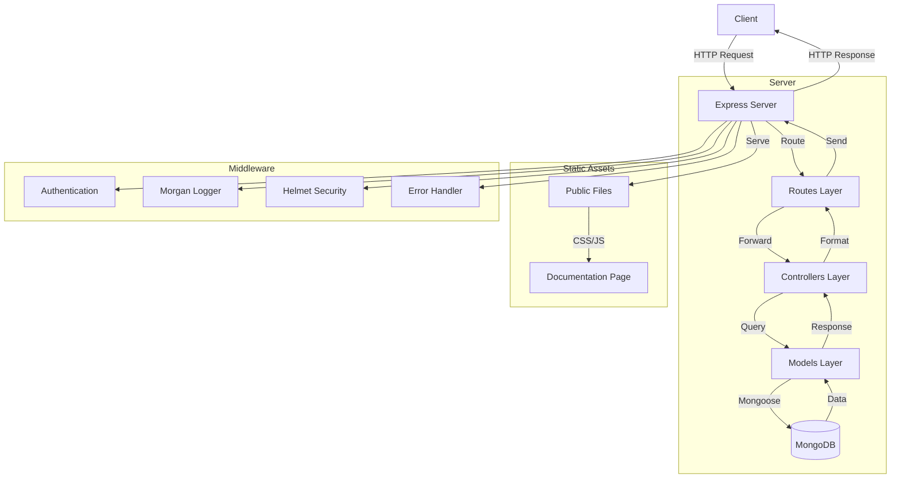

# Express API Template

A modern Express.js API template with MongoDB integration, static documentation, and best practices.

## Features

- 🚀 Modern ES Modules syntax
- 📝 Interactive API documentation
- 🗄️ MongoDB integration with Mongoose
- 🔒 Security headers with Helmet
- 📊 Request logging with Morgan
- 🎨 PUG templating engine
- 🌐 CORS enabled
- ⚡ Static file serving
- 🔄 Hot reloading in development
- 💅 Code formatting with Prettier
- 🧹 Linting with ESLint

## Prerequisites

- Node.js (v14 or higher)
- MongoDB
- npm or yarn

## Getting Started

1. Clone the repository:

```bash
git clone https://github.com/yourusername/express-api-template.git
cd express-api-template
```

2. Install dependencies:

```bash
npm install
```

3. Create a `.env` file in the root directory:

```env
PORT=3000
MONGODB_URI=mongodb://localhost:27017/api-template
NODE_ENV=development
```

4. Start the development server:

```bash
npm run dev
```

The API will be available at `http://localhost:3000`

## Project Structure

```
.
├── public/                 # Static files
│   ├── css/               # CSS files
│   ├── js/                # Client-side JavaScript
│   └── images/            # Image files
├── src/
│   ├── controllers/       # Route controllers
│   ├── middleware/        # Custom middleware
│   ├── models/            # Mongoose models
│   ├── routes/            # Route definitions
│   ├── views/             # Pug templates
│   ├── app.js            # Express app setup
│   └── server.js         # Server entry point
├── .env                   # Environment variables
├── .gitignore
└── package.json
```

## Available Scripts

- `npm start`: Start the production server
- `npm run dev`: Start the development server with hot reloading
- `npm run lint`: Run ESLint
- `npm run format`: Format code with Prettier

## API Endpoints

### Health Check

- `GET /api/health`: Check API status

### Users

- `GET /api/users`: Get all users
- `GET /api/users/:id`: Get user by ID
- `POST /api/users`: Create new user
- `PUT /api/users/:id`: Update user
- `DELETE /api/users/:id`: Delete user

## Documentation

Interactive API documentation is available at the root URL (`/`) when the server is running. The documentation includes:

- Detailed endpoint descriptions
- Request/response examples
- Interactive code blocks (click to copy)
- Error handling information

## Error Handling

The API uses standard HTTP status codes and returns error responses in the following format:

```json
{
  "error": "Error Type",
  "message": "Error description"
}
```

## Security

This template includes several security features:

- Helmet.js for security headers
- CORS configuration
- Request rate limiting (TODO)
- Input validation (TODO)
- Authentication (TODO)

## Contributing

1. Fork the repository
2. Create your feature branch (`git checkout -b feature/amazing-feature`)
3. Commit your changes (`git commit -m 'Add some amazing feature'`)
4. Push to the branch (`git push origin feature/amazing-feature`)
5. Open a Pull Request

## Future Enhancements

- [ ] Add authentication
- [ ] Add request validation
- [ ] Add rate limiting
- [ ] Add tests
- [ ] Add CI/CD pipeline
- [ ] Add Docker support
- [ ] Add API versioning
- [ ] Add caching
- [ ] Add file upload support

## License

This project is licensed under the MIT License - see the LICENSE file for details.

## Acknowledgments

- Express.js
- MongoDB
- Mongoose
- Pug
- And all other open-source packages used in this project

## Architecture and Data Flow



### Flow Description

1. **Client Request**: The client sends an HTTP request to the server
2. **Middleware Processing**:
   - Request passes through security checks (Helmet)
   - Request is logged (Morgan)
   - Request body is parsed (Express.json)
   - CORS is checked
3. **Routing**: The request is matched to the appropriate route
4. **Controller Logic**: The controller processes the request and interacts with models
5. **Database Operations**: Models perform CRUD operations on MongoDB
6. **Response Formation**: The controller formats the data
7. **Error Handling**: Any errors are caught and formatted
8. **Client Response**: The response is sent back to the client

### Static Content Flow

- Documentation page is served from Pug templates
- Static assets (CSS/JS) are served directly from the public folder
- Interactive features are handled by client-side JavaScript

### Github Actions

- CI
- Static HTML workflow
